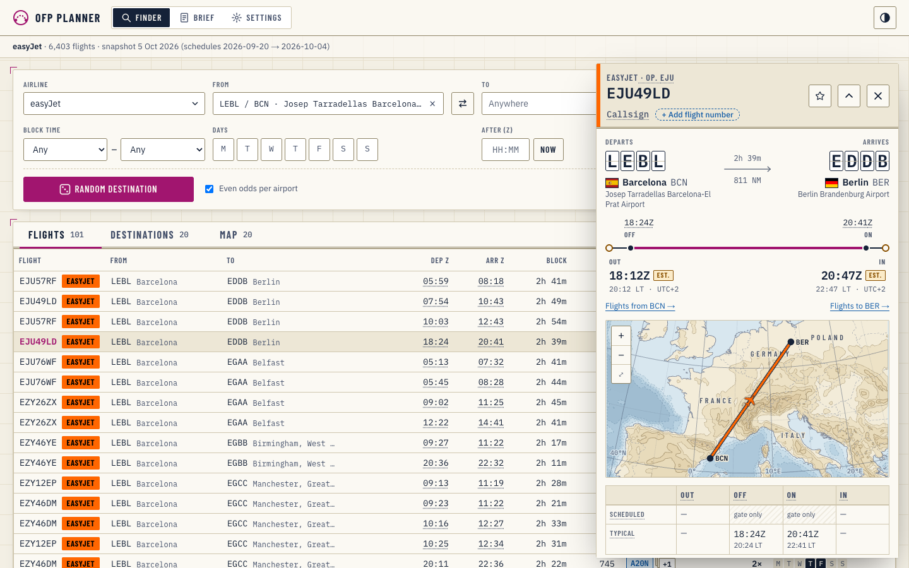
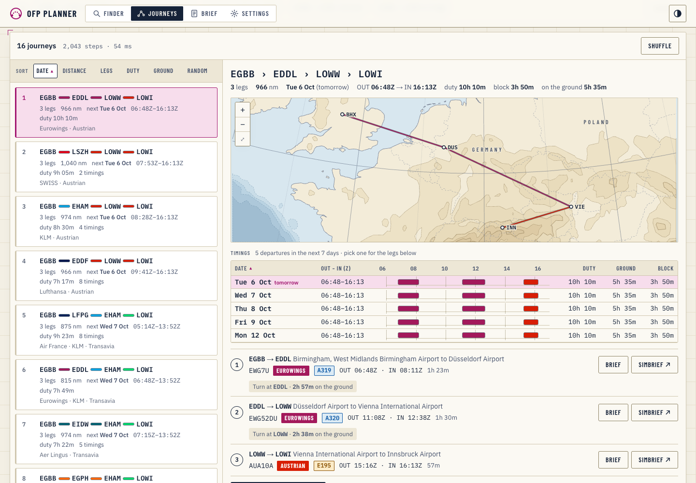
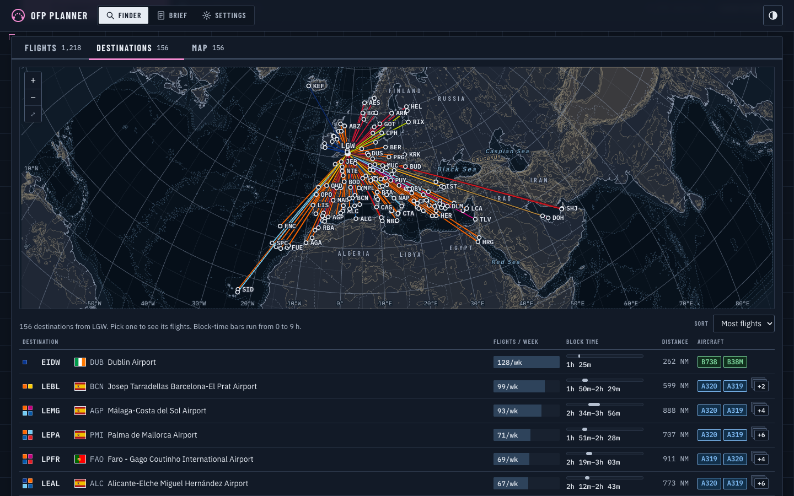
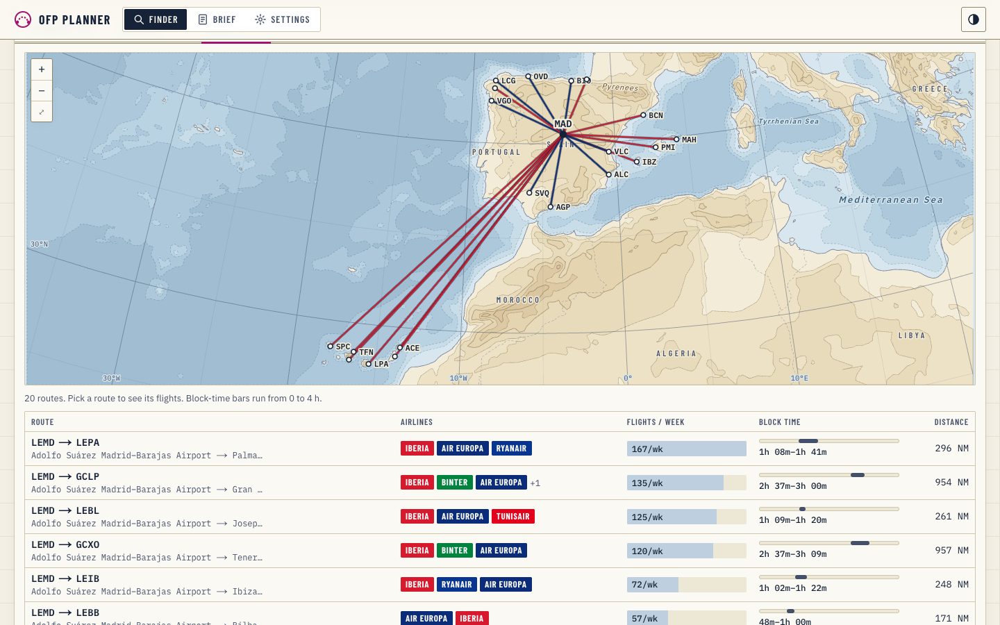
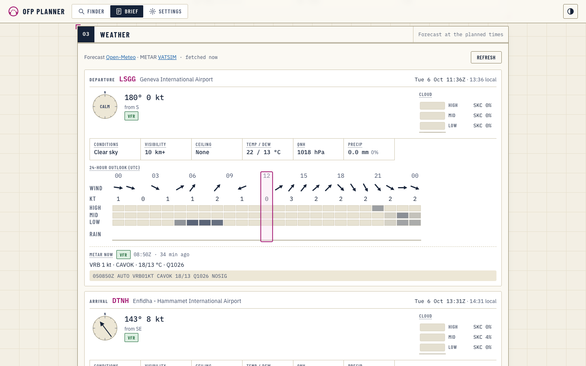
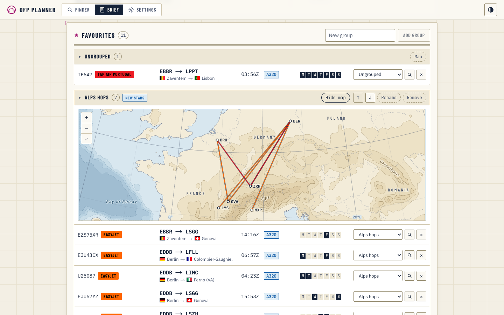
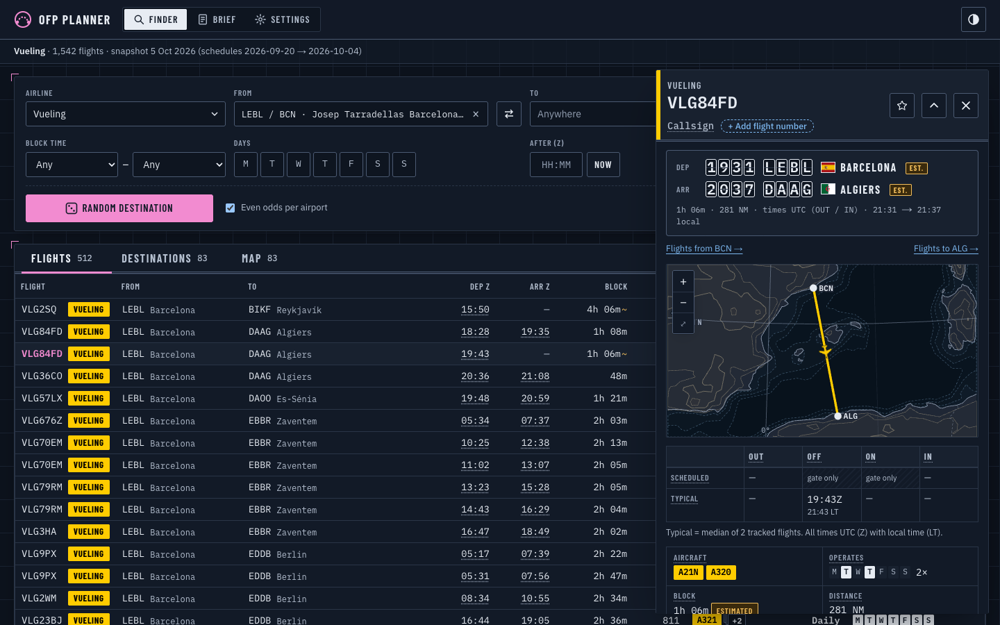
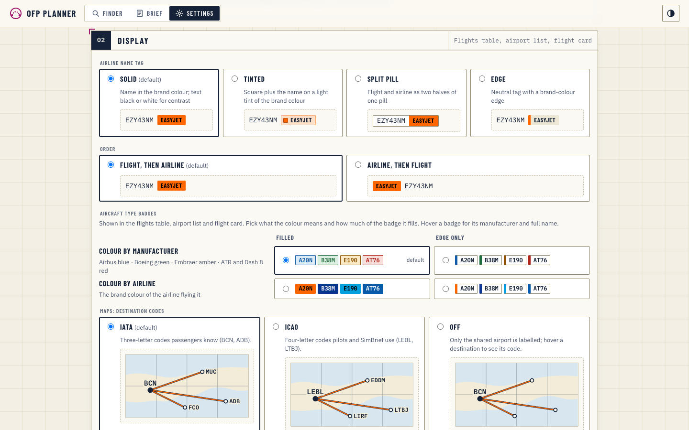
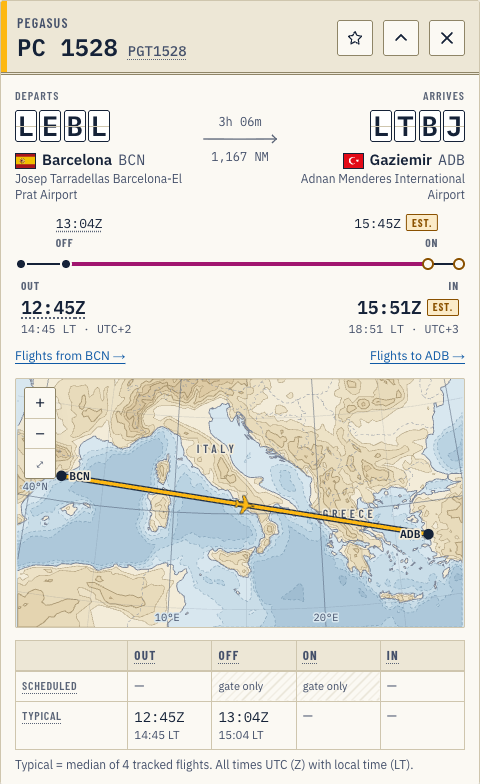
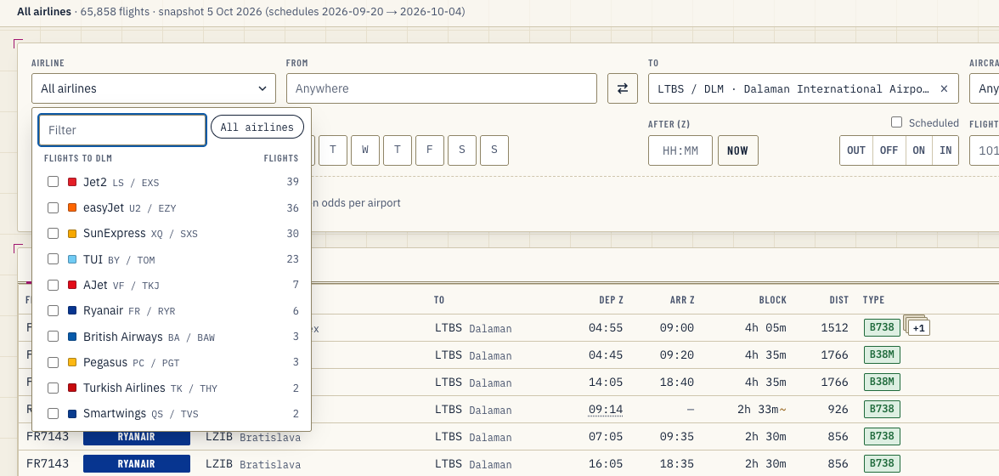

<div align="center">

# ✈︎ OFP Planner

**Pick a real airline flight for your flight sim, then dispatch it to SimBrief, right in your browser.**

Filter a schedule snapshot of 57 European and EMEA airlines, roll a random flight or destination, plan multi-leg journeys
with real connections, browse every route from an airport on a chart, compare scheduled and tracked OUT · OFF · ON · IN times,
and check the weather for the day you fly.



</div>

---

## Contents

- [Highlights](#highlights)
- [Screenshots](#screenshots)
- [Getting started](#getting-started)
- [Using it](#using-it)
- [How it works](#how-it-works)
- [The schedule data](#the-schedule-data)
- [Saved data](#saved-data)
- [Project structure](#project-structure)
- [Accessibility](#accessibility)
- [Limitations](#limitations)
- [Disclaimer](#disclaimer)

## Highlights

- **No server, no API at runtime.** The schedule is a static snapshot built offline and served as JSON; filtering, maps and dispatch links all happen in the browser. The app is a static site.
- **Real flights, real callsigns.** 65,858 flights across 57 airlines (easyJet, Ryanair, Wizz, BA, Lufthansa group, KLM/AF, Pegasus, Turkish and more), with the ATC callsigns actually flown (EJU54LH), aircraft types, operating days and tracked times.
- **Find anything.** Filter by airline, origin and destination (an airport *or* a whole country), aircraft type or family, block time, days, an **After (Z)** time against OUT / OFF / ON / IN, and flight number or callsign. Every filter lives in the URL.
- **Roll a flight.** Random flight, random destination from an airport or random origin into one, with even odds per airport so busy routes don't dominate. **Next leg** continues from where you land after a realistic turnaround.
- **Charts, not just lists.** Destinations from an airport and every route matching the filters (Madrid → Spain, say) on an azimuthal chart: sea depth and land height contours, a lat/long grid with degrees on the edges, sea, country and mountain lettering, routes in airline colours. Zoom and pan with two fingers, pinch or the buttons.
- **The times that matter.** Scheduled gate times (STD / STA) beside typical tracked OUT, OFF, ON and IN; anything neither scheduled nor tracked is estimated and badged **EST.** Shown as a timeline, a boarding pass or a split-flap departure board.
- **One click to SimBrief.** Dispatch links carry airline, flight number, callsign, route, type and departure time. Your saved SimBrief airframes replace the scheduled type automatically for the same family. Add your own flight number to callsign-only flights.
- **Multi-leg journeys.** Plan a route with stops: from an airport, through stops in order, to an airport, with either end open (roam from home, or work backwards to where your duty should end). Ask for the fewest legs, exactly N or up to N, over the whole route network (any day) or as **timed connections** of real flights with a turnaround window, a day, a first departure, a **duty limit** and a detour limit. Sort the list by date, distance, legs, duty or time on the ground; every timed journey shows its dates for the coming week as a sortable timeline, soonest first. Brief or dispatch each leg, or save the journey as a favourites group.
- **A brief for the day you fly.** Pick the date, get the Open-Meteo forecast at both ends for the planned times: a verdict for each end with advice, an illustrated scene of each airport with hazards, wind (OFP Reader's wind arrows), visibility, temperature and QNH, a through-the-day strip with your flight on it, and the forecast coded like a METAR beside the current METAR from VATSIM on printer paper. Fetched only on this page, and cached.
- **Favourites in groups.** Star flights into groups ("Alps hops", "Ryanair B738"), open a group's routes on a map, and brief any of them in one click.
- **Explains itself.** Hover (or focus) any label, aircraft badge, flag or airline square: OOOI definitions, manufacturer and model, a country's airports and flights, which airlines fly a route.
- **Your layout.** Airline tag style and order, aircraft badge colours, flight-card style and map codes (IATA / ICAO / off) in Settings, each with a live sample.
- **Day and night themes**, both meeting WCAG AA contrast.

## Screenshots

**Journeys: Birmingham to Innsbruck in up to three legs, timed, soonest first**



| Destinations from Gatwick (night) | Every route from Madrid to Spain |
| --- | --- |
|  |  |

| Brief: weather at both ends | Favourites in groups |
| --- | --- |
|  |  |

| Departure-board card (night) | Settings with live samples |
| --- | --- |
|  |  |

**Flight card**



**Airlines flying an airport**



## Getting started

Requires **Node 20+** and **pnpm**.

```bash
pnpm install
pnpm dev          # http://localhost:3000
```

Production build (a fully static site in `./out`, deployable to any static host):

```bash
pnpm build
```

| Script | What it does |
| --- | --- |
| `pnpm dev` | Dev server (copies flags and builds the map outlines into `public/` first) |
| `pnpm build` | Static export to `out/` |
| `pnpm lint` | ESLint |
| `pnpm typecheck` | TypeScript, no emit |
| `pnpm verify` | Browser checks against `out/` (pages × phone/desktop × day/night: flows, contrast, layout shift, console errors); `-- --shots` saves screenshots |
| `pnpm data:snapshot` | Rebuild the schedule snapshot locally (see [The schedule data](#the-schedule-data)) |
| `pnpm data:push` | Send the local snapshot to the server over SSH, no rebuild |
| `pnpm map:terrain` | Rebuild the map's height and depth contours |

### Docker

The `Dockerfile` builds the static export and serves it with nginx on port 80 (`nginx.conf` maps `/brief` → `brief.html`, and serves `/data/` from a mounted `live/` folder first, so a new snapshot can be dropped in without a rebuild):

```bash
docker build -t ofp-planner .
docker run -p 8080:80 ofp-planner   # http://localhost:8080
```

Live at **[plans.massorbit.co.uk](https://plans.massorbit.co.uk)**, deployed with Dokploy from `main` ([docs/deploy.md](docs/deploy.md)).

## Using it

| To… | Do this |
| --- | --- |
| Find flights | Set **Airline**, **From** and **To** (type an ICAO, IATA, city or country), aircraft, block time, days or **After (Z)** |
| Roll a random flight | **Random flight**; set only **From** for a random destination, only **To** for a random origin |
| See where an airport goes | Set **From**, then the **Destinations** tab (map + list; pick one to see its flights) |
| See a whole network | Set the ends (airport, country or anywhere), then the **Map** tab |
| Open a flight | Click a row: the card floats over the right; ✕ or Esc closes it, clicking its header folds it |
| Dispatch | **Open in SimBrief** on the card (pick the aircraft or your airframe above it) |
| Fly the next leg | **Next leg from …** on the card, or on the brief: **A sample next leg** or **Next leg: all flights from …** |
| Plan a multi-leg journey | **Journeys**: From, stops, To (either end can be blank), legs, then **Any day** or **Timed connections** (day, first OUT, duty limit, turnaround); **Clear** starts again |
| Sort the journeys | The **Sort** headings over the list: Date, Distance, Legs, Duty, Ground, Random; click again to reverse |
| Pick a date and time | The **Timings** table under the map: every departure this week, soonest first, sortable by duty, ground or block; click a row |
| No direct flight? | **Journeys** with **Fewest** legs, sorted by **Distance**; **Find timed connections on this route** turns it into real flights |
| Plan the day | **Open brief · weather →**: set the date, read the forecast and METAR |
| Keep flights | ☆ on the card; make groups on the Brief start page or in Settings |
| Add a flight number | **+ Add flight number** under a callsign-only flight |
| Share a view | Copy the address bar: every filter, tab and the open flight are in the URL |
| Change how things look | ⚙ **Settings → Display** |

## How it works

```
adsb.lol daily archives ── tracks per aircraft ─┐
VRS standing data, tar1090-db, OurAirports ─────┤  scripts/snapshot/  (offline, on your machine)
Ryanair public timetable ───────────────────────┘
   ▼
public/data/  manifest · airports · routes · airlines/<ICAO>.json      (static JSON, ~1.2 MB gzipped)
   ▼
browser: lib/data/load.ts → query.ts (filter · sort · group · roll · next leg) → React views
   ▼
dispatch.simbrief.com/options/custom?airline=…&fltnum=…&callsign=…   · Open-Meteo + VATSIM on the Brief
```

- A **flight** is one operator + callsign + origin + destination at one departure time, seen at least twice in the window or confirmed by a timetable. OFF and ON come from the first and last airborne points (±1 min); OUT and IN from continuous ground tracks where coverage allows.
- Airline files load only for the airlines selected; a small route index answers "who flies here" without loading them all.
- Maps are drawn as SVG at their real pixel size with d3-geo (azimuthal equidistant, centred on the routes), over Natural Earth outlines and contours built from AWS Terrain Tiles.

## The schedule data

The current snapshot covers **20 Sep – 4 Oct 2026** (15 days): 57 airlines, 65,858 flights, 15,600 routes, 581 airports.

| Source | Licence | Used for |
| --- | --- | --- |
| [adsb.lol](https://github.com/adsblol) globe history | ODbL 1.0 | every observed flight: callsign, route, days, OUT/OFF/ON/IN |
| [VRS standing data](https://github.com/vradarserver/standing-data) | CC0 | the unseen end of a route; aircraft types |
| [tar1090-db](https://github.com/wiedehopf/tar1090-db) | none stated | aircraft type per airframe |
| [OurAirports](https://ourairports.com/data/) · [mwgg/Airports](https://github.com/mwgg/Airports) | public domain · MIT | airports, coordinates, time zones |
| Ryanair public timetable | Ryanair site data, light non-commercial use | Ryanair flight numbers and STD/STA |

Rebuild it locally and send it to the live site without a redeploy:

```bash
pnpm data:snapshot --days 15 --end 2026-10-04   # only new days are downloaded
pnpm data:push                                  # rsync to the server, swapped in atomically
```

The pipeline is CLI-only and never runs on the server or the web. Details: [docs/data-pipeline.md](docs/data-pipeline.md).

## Saved data

Everything you save stays in the browser. Nothing is sent anywhere.

| What | Where | Key |
| --- | --- | --- |
| Favourites and their groups | `localStorage` | `ofp-planner:favourites`, `ofp-planner:fav-groups` |
| Recent flights | `localStorage` | `ofp-planner:history` |
| The flight on the Brief (and its date) | `localStorage` | `ofp-planner:ready` |
| Saved airframes | `localStorage` | `ofp-planner:airframes` |
| Flight numbers you add | `localStorage` | `ofp-planner:flight-numbers` |
| Display choices | `localStorage` | `ofp-planner:display` |
| Finder preferences (airline, sort, view) | `localStorage` | `ofp-planner:prefs` |
| Weather cache (forecast 60 min, METAR 10 min) | `localStorage` | `ofp-planner:wx:<ICAO>:…` |
| Theme preference | `localStorage` | `ofp-planner-theme` |

Clearing site data or using a private window removes everything; **Clear all saved data** in Settings does the same on purpose.

## Project structure

```
src/
├── app/
│   ├── layout.tsx            fonts, theme boot script, tooltip layer, footer
│   ├── page.tsx              finder
│   ├── brief/page.tsx        brief
│   ├── settings/page.tsx     settings
│   └── base.css · planner.css · wx.css   design tokens (day / night) and styles
├── components/
│   ├── FinderApp.tsx         filters, roll bar, Flights / Destinations / Map tabs, floating card
│   ├── Results.tsx           flights table, destinations list
│   ├── RoutesView.tsx        map tab: every matching route + table
│   ├── FlightCard.tsx        card header, map, OOOI table, facts, SimBrief dispatch
│   ├── RouteHead.tsx         departs / arrives: timeline, boarding pass, departure board
│   ├── RouteMap.tsx          chart (terrain, grid, lettering, routes, zoom)
│   ├── BriefApp.tsx          brief: start page, date, next leg, weather
│   ├── SavedFlights.tsx      favourites in groups + recent
│   ├── SettingsApp.tsx       airframes, display (with samples), snapshot, storage
│   ├── pickers.tsx           airport/country combobox, multi-select, days, block time, After (Z)
│   ├── badges.tsx            airline tags, aircraft badges, week strip, “+n” pile
│   ├── Flag.tsx              flags with country hover labels
│   └── wx/                   forecast and METAR cards
└── lib/
    ├── data/                 contract (types), loading, query engine, flight helpers
    ├── simbrief.ts           airframes + dispatch links
    ├── saved.ts · display.ts · fnoverride.ts · storage.ts   everything kept in the browser
    ├── terrain.ts · outlines.ts · maplabels.ts               map layers
    └── wx/                   Open-Meteo forecast, VATSIM METAR, categories, cache
scripts/
├── snapshot/                 the schedule pipeline (pnpm data:snapshot)
├── push-data.sh              pnpm data:push
├── build-terrain.mjs · build-geo.mjs   map data
└── verify.mjs                browser checks
```

**Stack:** Next.js 16 (static export) · React 19 · TypeScript · [d3-geo](https://github.com/d3/d3-geo) for the maps · [flag-icons](https://github.com/lipis/flag-icons) (MIT) for country flags · [Natural Earth](https://www.naturalearthdata.com/) (public domain) outlines · [AWS Terrain Tiles](https://registry.opendata.aws/terrain-tiles/) for elevation · [Open-Meteo](https://open-meteo.com/) (CC BY 4.0) and VATSIM for weather. No UI framework; styles are plain CSS with design tokens.

## Accessibility

- Every text / background pair meets **WCAG AA (≥ 4.5 : 1)** in both themes, checked in the browser on every page by `pnpm verify`.
- Brand colours are only used as fills with black or white text chosen for contrast, and route lines are cased for 3 : 1 against the map.
- Tooltips open on hover *and* keyboard focus; the airport picker is a full ARIA combobox; maps label their airports for screen readers.
- Works down to phone width without horizontal scrolling, with no layout shift on load; respects `prefers-reduced-motion`.

## Limitations

- **Flight numbers:** open data only knows most airlines' flights by callsign (EJU54LH). The callsign is real and is what ATC uses; add the marketing number yourself if you want it.
- **Scheduled times** exist only for Ryanair. Elsewhere the times are typical tracked times, and the rest are estimates (marked EST.).
- **Coverage** is thinner over North Africa, the Middle East and the sea, and a 15-day window can miss weekly flights. Schedules change at the end of March and October.
- Brand colours and some city names come from the source data and are approximate.

## Disclaimer

For flight simulation only. **Not for real-world flight planning or navigation.** Not affiliated with SimBrief, Navigraph or any airline.

---

<sub>© Mohamed Omar. All rights reserved.</sub>
